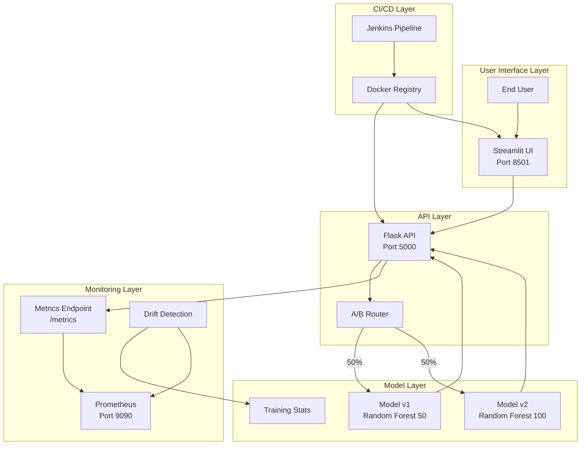
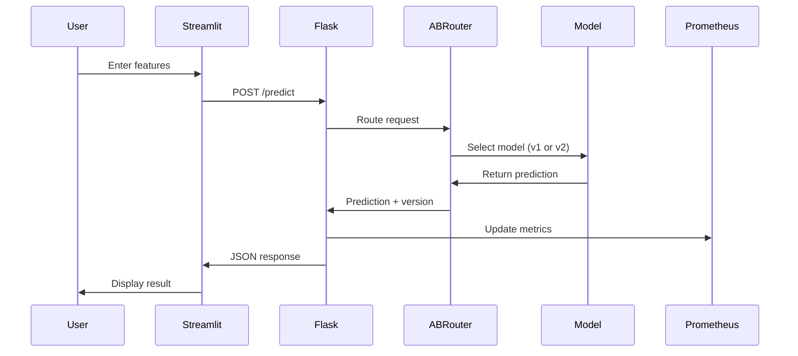
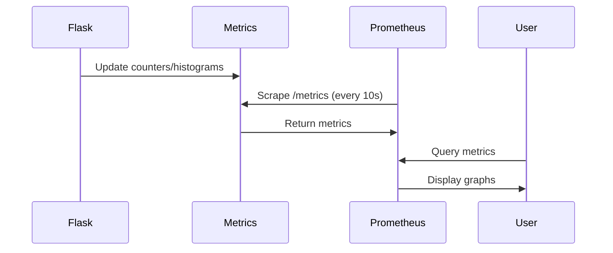

# MLOps Pipeline Architecture

## System Overview

This document provides a detailed explanation of the MLOps pipeline architecture, components, and data flow.

## Architecture Diagram



## Component Details

### 1. Flask API (Port 5000)

**Purpose**: Serves ML predictions with A/B testing capabilities

**Key Features**:
- RESTful API endpoints
- A/B testing router
- Prometheus metrics integration
- Health check endpoint
- Configuration endpoint

**Endpoints**:
- `POST /predict` - Make predictions
- `GET /health` - Health check
- `GET /metrics` - Prometheus metrics
- `GET /config` - A/B testing configuration

**A/B Testing Logic**:
```python
# Weighted random selection
total_weight = MODEL_V1_WEIGHT + MODEL_V2_WEIGHT
rand_val = random.randint(1, total_weight)

if rand_val <= MODEL_V1_WEIGHT:
    use model_v1
else:
    use model_v2
```

### 2. Streamlit UI (Port 8501)

**Purpose**: Interactive web interface for testing models

**Features**:
- Feature input sliders
- Real-time predictions
- Model version tracking
- Usage statistics
- Prediction history

**User Flow**:
1. User adjusts feature sliders
2. Clicks "Get Prediction"
3. UI sends request to Flask API
4. Displays prediction and model version
5. Updates statistics

### 3. Model Layer

**Model v1**:
- Algorithm: Random Forest
- Estimators: 50
- Max Depth: 5
- Purpose: Baseline model

**Model v2**:
- Algorithm: Random Forest
- Estimators: 100
- Max Depth: 7
- Purpose: Improved model

**Training Data**: Iris dataset (150 samples, 4 features, 3 classes)

### 4. Prometheus Monitoring (Port 9090)

**Metrics Collected**:

| Metric | Type | Description |
|--------|------|-------------|
| `prediction_requests_total` | Counter | Total prediction requests |
| `model_version_requests_total{version}` | Counter | Requests per model version |
| `prediction_latency_seconds` | Histogram | Request latency distribution |
| `prediction_errors_total` | Counter | Total errors |
| `model_drift_score` | Gauge | Drift indicator (0-1) |

**Scrape Configuration**:
- Interval: 10 seconds
- Target: `flask-api:5000/metrics`

### 5. Drift Detection

**Algorithm**:
1. Compare current feature statistics to training statistics
2. Calculate normalized differences for mean and std
3. Combine into single drift score (0-1)
4. Alert if score > threshold (default: 0.3)

**Formula**:
```
mean_diff = |current_mean - training_mean| / training_std
std_diff = |current_std - training_std| / training_std
drift_score = mean(mean_diff + std_diff) / 2
```

### 6. Jenkins CI/CD Pipeline

**Pipeline Stages**:

1. **Checkout**: Get code from repository
2. **Setup**: Install Python dependencies
3. **Train Models**: Generate model versions
4. **Test**: Run unit tests
5. **Build**: Create Docker images
6. **Push**: Upload to registry (optional)
7. **Deploy**: Start services with docker-compose
8. **Health Check**: Verify services are running
9. **Smoke Test**: Test prediction endpoint

**Artifacts**:
- Trained models (archived as tar.gz)
- Docker images
- Test reports

## Data Flow

### Prediction Request Flow



### Monitoring Flow



## Deployment Architecture

### Local Development (Docker Compose)

```
┌─────────────────────────────────────┐
│         Docker Host                 │
│                                     │
│  ┌──────────┐  ┌──────────────┐   │
│  │ Flask    │  │  Streamlit   │   │
│  │ API      │  │  UI          │   │
│  │ :5000    │  │  :8501       │   │
│  └────┬─────┘  └──────┬───────┘   │
│       │                │            │
│       └────────┬───────┘            │
│                │                    │
│         ┌──────┴────────┐          │
│         │  Prometheus   │          │
│         │  :9090        │          │
│         └───────────────┘          │
│                                     │
│  Network: mlops-network (bridge)   │
└─────────────────────────────────────┘
```

### Production (Single EC2 Instance)

```
┌─────────────────────────────────────┐
│      AWS EC2 Instance               │
│      (Amazon Linux / RHEL)          │
│                                     │
│  ┌─────────────────────────────┐   │
│  │   Docker Compose            │   │
│  │                             │   │
│  │  ┌────┐ ┌────┐ ┌────┐     │   │
│  │  │API │ │UI  │ │Prom│     │   │
│  │  └────┘ └────┘ └────┘     │   │
│  └─────────────────────────────┘   │
│                                     │
│  Security Group:                    │
│  - Port 22 (SSH)                    │
│  - Port 5000 (API)                  │
│  - Port 8501 (UI)                   │
│  - Port 9090 (Prometheus)           │
└─────────────────────────────────────┘
```

## Configuration

### Environment Variables

**Flask API**:
- `MODEL_V1_WEIGHT`: Traffic percentage for model v1 (default: 50)
- `MODEL_V2_WEIGHT`: Traffic percentage for model v2 (default: 50)

**Example Configurations**:

| Scenario | V1 Weight | V2 Weight | Description |
|----------|-----------|-----------|-------------|
| Equal split | 50 | 50 | 50/50 A/B test |
| Canary | 90 | 10 | 10% to new model |
| Full rollout | 0 | 100 | 100% to new model |
| Rollback | 100 | 0 | 100% to old model |

### Docker Compose Configuration

Modify `docker-compose.yml` to change A/B split:

```yaml
services:
  flask-api:
    environment:
      - MODEL_V1_WEIGHT=70
      - MODEL_V2_WEIGHT=30
```

## Scaling Considerations

### Current Limitations
- Single instance deployment
- In-memory metrics (lost on restart)
- No load balancing
- No model versioning system

### Future Enhancements
1. **Horizontal Scaling**: Multiple API instances behind load balancer
2. **Persistent Metrics**: Use Prometheus with persistent storage
3. **Model Registry**: MLflow or similar for version management
4. **Database**: Store predictions and metadata
5. **Message Queue**: Async prediction processing
6. **Caching**: Redis for frequently requested predictions
7. **Auto-scaling**: Based on request volume

## Security Considerations

### Current Implementation
- No authentication on endpoints
- Open ports in security group
- No HTTPS/TLS
- No secrets management

### Production Recommendations
1. Add API authentication (JWT, API keys)
2. Implement HTTPS with SSL certificates
3. Restrict security group to specific IPs
4. Use AWS Secrets Manager for credentials
5. Add rate limiting
6. Implement input validation and sanitization
7. Enable CORS properly
8. Add audit logging

## Monitoring Best Practices

### Key Metrics to Track

**Business Metrics**:
- Prediction volume
- Model version distribution
- Response time percentiles (p50, p95, p99)

**Technical Metrics**:
- Error rate
- API availability
- Container health
- Resource utilization (CPU, memory)

**ML Metrics**:
- Drift score
- Prediction distribution
- Model accuracy (if ground truth available)

### Alerting Rules

Example Prometheus alerts:

```yaml
# High error rate
- alert: HighErrorRate
  expr: rate(prediction_errors_total[5m]) > 0.05
  
# High latency
- alert: HighLatency
  expr: histogram_quantile(0.95, prediction_latency_seconds) > 1.0
  
# Drift detected
- alert: ModelDrift
  expr: model_drift_score > 0.3
```

## Troubleshooting Guide

### Common Issues

**Issue**: Models not found
- **Solution**: Run `python app/train_model.py`

**Issue**: Port already in use
- **Solution**: `docker-compose down` or kill process on port

**Issue**: Services not starting
- **Solution**: Check logs with `docker-compose logs`

**Issue**: Cannot connect to API from Streamlit
- **Solution**: Ensure services are on same Docker network

**Issue**: Prometheus not scraping metrics
- **Solution**: Check `prometheus.yml` configuration and network connectivity

## Performance Benchmarks

Typical performance on t3.medium instance:

- **Prediction Latency**: 10-50ms (p95)
- **Throughput**: ~100 requests/second
- **Memory Usage**: 
  - Flask API: ~200MB
  - Streamlit: ~150MB
  - Prometheus: ~100MB
- **CPU Usage**: <10% at moderate load

## References

- [Flask Documentation](https://flask.palletsprojects.com/)
- [Streamlit Documentation](https://docs.streamlit.io/)
- [Prometheus Documentation](https://prometheus.io/docs/)
- [scikit-learn Documentation](https://scikit-learn.org/)
- [Docker Compose Documentation](https://docs.docker.com/compose/)
