# MLOps Pipeline - Visual Diagrams

This document contains various diagrams to help understand the system architecture and workflows.

## 1. High-Level Architecture

```mermaid
graph TB
    subgraph "User Layer"
        USER[👤 User/Data Scientist]
    end
    
    subgraph "Interface Layer"
        UI[🎨 Streamlit UI<br/>Port 8501]
        API[🌐 Flask API<br/>Port 5000]
    end
    
    subgraph "ML Layer"
        AB[🔀 A/B Router<br/>50/50 Split]
        M1[🤖 Model v1<br/>RF-50 Trees]
        M2[🤖 Model v2<br/>RF-100 Trees]
    end
    
    subgraph "Monitoring Layer"
        PROM[📊 Prometheus<br/>Port 9090]
        METRICS[📈 Metrics<br/>/metrics]
        DRIFT[🔍 Drift Detection]
    end
    
    subgraph "Infrastructure"
        DOCKER[🐳 Docker Compose]
        JENKINS[🔄 Jenkins CI/CD]
    end
    
    USER --> UI
    USER --> API
    UI --> API
    API --> AB
    AB --> M1
    AB --> M2
    API --> METRICS
    METRICS --> PROM
    DRIFT --> PROM
    DOCKER --> UI
    DOCKER --> API
    DOCKER --> PROM
    JENKINS --> DOCKER
```



## 2. Request Flow


## 3. CI/CD Pipeline

```mermaid
graph LR
    A[📝 Code Commit] --> B[🔍 Checkout]
    B --> C[🐍 Setup Python]
    C --> D[🧪 Run Tests]
    D --> E[🤖 Train Models]
    E --> F[🐳 Build Images]
    F --> G[📦 Push to Registry]
    G --> H[🚀 Deploy]
    H --> I[✅ Health Check]
    I --> J[🔬 Smoke Test]
    
    style A fill:#e1f5ff
    style D fill:#fff3cd
    style E fill:#d4edda
    style F fill:#cce5ff
    style H fill:#d1ecf1
    style J fill:#d4edda
```



## 4. Data Flow

```mermaid
flowchart TD
    A[📊 Training Data<br/>Iris Dataset] --> B[🎓 Training Script]
    B --> C[💾 Model v1.pkl]
    B --> D[💾 Model v2.pkl]
    B --> E[📈 Training Stats]
    
    F[👤 User Input] --> G[🌐 API Request]
    G --> H{🔀 A/B Router}
    
    H -->|50%| C
    H -->|50%| D
    
    C --> I[🎯 Prediction]
    D --> I
    
    I --> J[📊 Metrics Update]
    J --> K[📈 Prometheus]
    
    E --> L[🔍 Drift Detection]
    L --> K
    
    I --> M[📤 Response]
    M --> N[👤 User]
```



## 5. Monitoring Architecture

```mermaid
graph TB
    subgraph "Application"
        API[Flask API]
        COUNTER[Request Counter]
        HISTOGRAM[Latency Histogram]
        GAUGE[Drift Gauge]
    end
    
    subgraph "Metrics Collection"
        ENDPOINT[/metrics Endpoint]
        EXPORTER[Prometheus Client]
    end
    
    subgraph "Monitoring"
        PROM[Prometheus Server]
        SCRAPER[Scraper<br/>10s interval]
        TSDB[Time Series DB]
    end
    
    subgraph "Visualization"
        QUERY[PromQL Queries]
        GRAPHS[Graphs & Alerts]
    end
    
    API --> COUNTER
    API --> HISTOGRAM
    API --> GAUGE
    
    COUNTER --> EXPORTER
    HISTOGRAM --> EXPORTER
    GAUGE --> EXPORTER
    
    EXPORTER --> ENDPOINT
    ENDPOINT --> SCRAPER
    SCRAPER --> PROM
    PROM --> TSDB
    TSDB --> QUERY
    QUERY --> GRAPHS
```

## 6. Deployment Architecture

### Local Development

```mermaid
graph TB
    subgraph "Docker Host"
        subgraph "mlops-network"
            API[Flask API<br/>Container]
            UI[Streamlit UI<br/>Container]
            PROM[Prometheus<br/>Container]
        end
        
        VOL[Volume<br/>Models]
    end
    
    API -.->|mount| VOL
    UI -.->|network| API
    PROM -.->|scrape| API
    
    USER[👤 User] -->|:8501| UI
    USER -->|:5000| API
    USER -->|:9090| PROM
```



### Production (EC2)


## 7. A/B Testing Logic


## 8. Model Training Workflow

```mermaid
flowchart LR
    A[📊 Load Iris<br/>Dataset] --> B[✂️ Train/Test<br/>Split]
    
    B --> C[🎓 Train Model v1<br/>50 Trees]
    B --> D[🎓 Train Model v2<br/>100 Trees]
    
    C --> E[📊 Evaluate v1]
    D --> F[📊 Evaluate v2]
    
    E --> G[💾 Save model_v1.pkl]
    F --> H[💾 Save model_v2.pkl]
    
    B --> I[📈 Calculate Stats]
    I --> J[💾 Save training_stats.pkl]
    
    style C fill:#e8f5e9
    style D fill:#e8f5e9
    style G fill:#bbdefb
    style H fill:#bbdefb
    style J fill:#fff9c4
```



## 9. Drift Detection Process

```mermaid
flowchart TD
    A[📊 Current<br/>Predictions] --> B[📈 Calculate<br/>Statistics]
    C[💾 Training<br/>Statistics] --> D[📊 Compare<br/>Distributions]
    
    B --> D
    
    D --> E{Drift Score<br/>> Threshold?}
    
    E -->|Yes| F[⚠️ Alert:<br/>Drift Detected]
    E -->|No| G[✅ OK:<br/>No Drift]
    
    F --> H[📊 Update<br/>Metric]
    G --> H
    
    H --> I[📈 Prometheus<br/>Gauge]
    
    style F fill:#ffebee
    style G fill:#e8f5e9
```



## 10. Complete System Overview

```mermaid
graph TB
    subgraph "Development"
        DEV[👨‍💻 Developer]
        CODE[📝 Code]
        GIT[📦 Git Repo]
    end
    
    subgraph "CI/CD"
        JENKINS[🔄 Jenkins]
        TEST[🧪 Tests]
        BUILD[🏗️ Build]
    end
    
    subgraph "Container Registry"
        REGISTRY[📦 Docker Images]
    end
    
    subgraph "Production"
        COMPOSE[🐳 Docker Compose]
        
        subgraph "Services"
            API[🌐 API]
            UI[🎨 UI]
            PROM[📊 Prometheus]
        end
        
        subgraph "ML"
            M1[🤖 Model v1]
            M2[🤖 Model v2]
        end
    end
    
    subgraph "Users"
        USER[👤 End User]
        DS[👨‍🔬 Data Scientist]
    end
    
    DEV --> CODE
    CODE --> GIT
    GIT --> JENKINS
    JENKINS --> TEST
    TEST --> BUILD
    BUILD --> REGISTRY
    REGISTRY --> COMPOSE
    
    COMPOSE --> API
    COMPOSE --> UI
    COMPOSE --> PROM
    
    API --> M1
    API --> M2
    
    USER --> UI
    DS --> API
    
    API --> PROM
```



## 11. Metrics Collection Flow


## 12. Error Handling Flow


## Legend

- 🎨 User Interface
- 🌐 API/Service
- 🤖 ML Model
- 📊 Monitoring
- 🐳 Container
- 🔄 CI/CD
- 💾 Storage
- 🔀 Router/Logic
- 👤 User
- 📈 Metrics
- 🔍 Analysis
- ⚠️ Alert
- ✅ Success

## Using These Diagrams

These diagrams are written in Mermaid syntax and will render automatically in:
- GitHub
- GitLab
- Many markdown viewers
- VS Code with Mermaid extension

To view locally, use a Mermaid-compatible viewer or paste into https://mermaid.live
